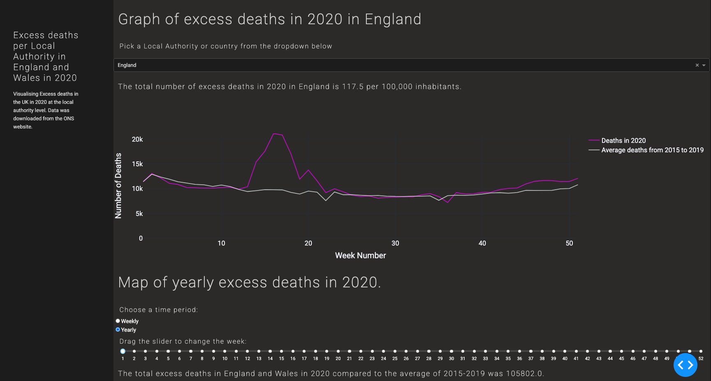

# excess_deaths_dash

This dashboard was made to visualise the weekly excess death data in the UK in 2020 compared to the average of deaths form 2015 to 2019.
The data came from the ONS and the population was the 2019 estimate. 

## Data was acquired from: 
- Population data came from estimates 2019: [ONS population estimates](https://www.ons.gov.uk/peoplepopulationandcommunity/populationandmigration/populationestimates/datasets/populationestimatesforukenglandandwalesscotlandandnorthernireland)
- 2020 deaths registeres in England and Wales came from: [ONS death registrations](https://www.ons.gov.uk/peoplepopulationandcommunity/birthsdeathsandmarriages/deaths/bulletins/deathsregisteredweeklyinenglandandwalesprovisional/previousReleases), [this](https://www.ons.gov.uk/peoplepopulationandcommunity/healthandsocialcare/causesofdeath/datasets/deathregistrationsandoccurrencesbylocalauthorityandhealthboard) dataset in particular.
- Death registrations for 2015 to 2019: [ONS death information](https://www.ons.gov.uk/peoplepopulationandcommunity/birthsdeathsandmarriages/deaths/adhocs/12615deathregistrationsandfiveyearaverageweeklydeathsbylocalauthorityandplaceofoccurrenceenglandandwales2015to2019)
